<div align="center">

<h1>Better GDrive</h1>

<p><b>Google Drive sync for macOS that doesn't wreck your machine.</b><br>
Exclusions, throttle, pause, and multiple sync jobs — everything the official app refuses to do.</p>

<a href="https://github.com/juanchorossi/better-gdrive/stargazers"></a>
<a href="LICENSE"></a>

<a href="https://rclone.org"></a>

<br><br>

<a href="#install">Install</a> ·
<a href="#screenshots">Screenshots</a> ·
<a href="#building-from-source">Build from source</a> ·
<a href="#contributing">Contributing</a> ·
<a href="#license">License</a>

<br><br>

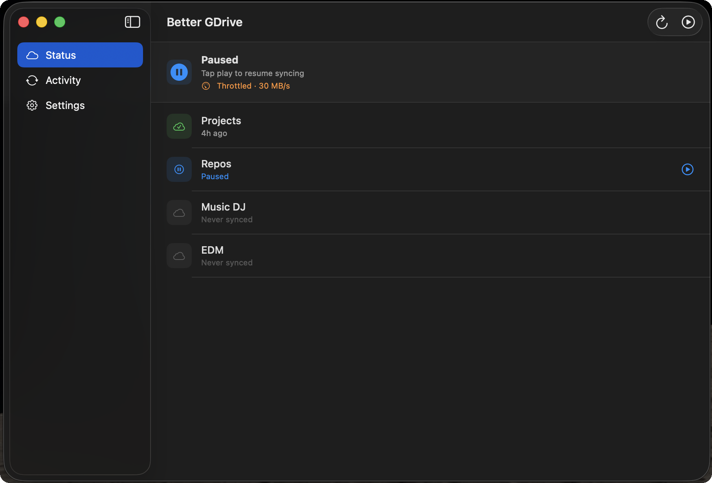

</div>

---

## The problem with Google Drive's official app

Drop a Node.js project into your Google Drive folder and watch your Mac suffer:

- **Hundreds of thousands of files** trying to sync from `node_modules` alone
- **CPU pinned at 100%** for hours, fans screaming
- **Drive quota consumed** by build artifacts, caches, and `.env` files
- **No way to pause** — quitting the app loses all progress
- **No bandwidth control** — it will saturate your upload on calls and there's nothing you can do

The official app is a black box. It syncs everything or nothing.

---

## What Better GDrive does differently

| Feature | Google Drive app | Better GDrive |
|---|:---:|:---:|
| Exclude `node_modules`, `.git`, build output | ✗ | ✓ |
| Per-folder exclude patterns (glob) | ✗ | ✓ |
| Real pause & resume | ✗ | ✓ |
| Bandwidth throttle (time-of-day schedule) | ✗ | ✓ |
| Sync vs Copy mode, per folder | ✗ | ✓ |
| Live upload activity feed | ✗ | ✓ |
| Auto-sync when local files change (FSEvents) | ✗ | ✓ |
| Multiple independent sync jobs | ✓ | ✓ |
| Runs in menu bar, no Dock icon | ✓ | ✓ |
| Token reconnect without leaving the app | ✗ | ✓ |

Powered by **[rclone](https://rclone.org)** — the battle-tested, open-source cloud sync engine.

---

## Screenshots

<table>
  <tr>
    <td align="center"><b>Menu bar popover</b></td>
    <td align="center"><b>Status view</b></td>
  </tr>
  <tr>
    <td>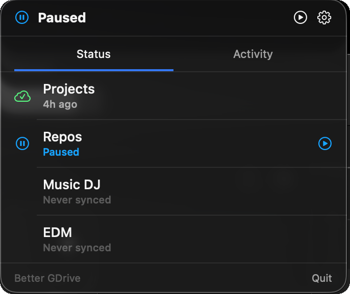</td>
    <td></td>
  </tr>
  <tr>
    <td align="center"><b>Activity feed</b></td>
    <td align="center"><b>Settings</b></td>
  </tr>
  <tr>
    <td>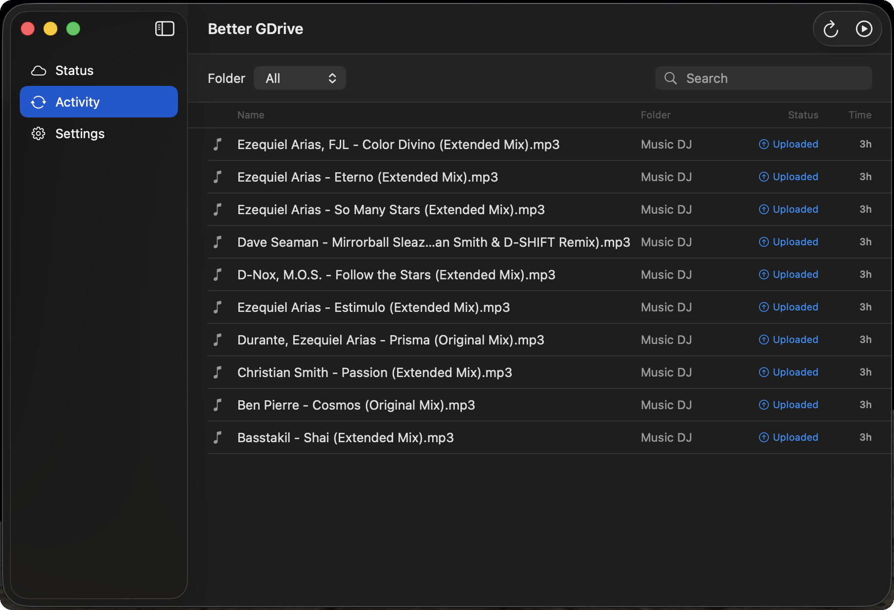</td>
    <td>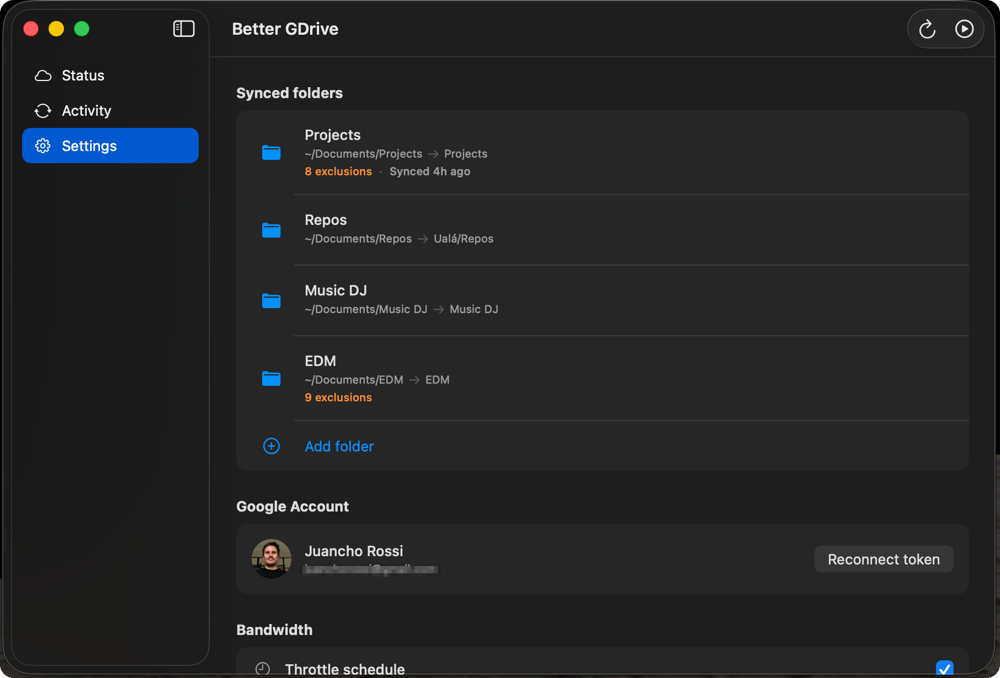</td>
  </tr>
  <tr>
    <td align="center" colspan="2"><b>Folder exclusions</b></td>
  </tr>
  <tr>
    <td align="center" colspan="2">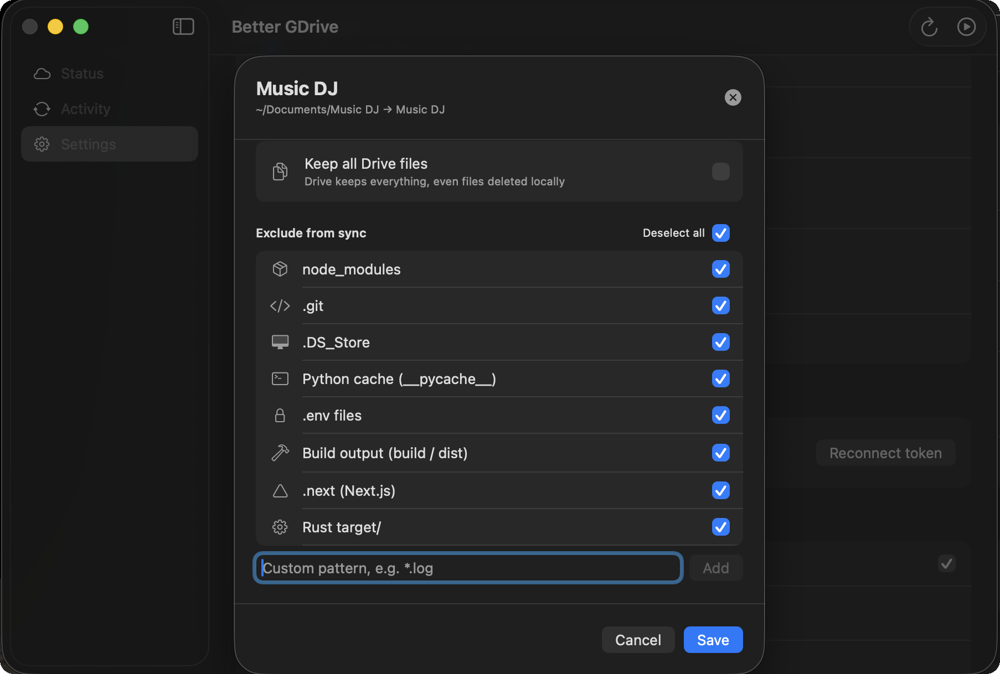</td>
  </tr>
</table>

---

## Install

There's no pre-built binary yet. Build from source (takes about 5 minutes):

### 1. Install dependencies

```bash
brew install rclone xcodegen
```

### 2. Clone and generate the Xcode project

```bash
git clone https://github.com/juanchorossi/better-gdrive.git
cd better-gdrive
xcodegen generate
```

### 3. Add the rclone binary

The bundled rclone binary is not included in the repo (84 MB). Download the macOS build from [rclone.org/downloads](https://rclone.org/downloads/) and place it at:

```
BetterGDrive/Resources/rclone
```

```bash
chmod +x BetterGDrive/Resources/rclone
```

### 4. Configure rclone

```bash
rclone config
# → New remote → name it "gdrive" → type "drive" → follow OAuth prompts
```

### 5. Build and run

```bash
open BetterGDrive.xcodeproj
# Cmd+R to build and run
```

---

## GCP setup <sub>one-time setup to get your own OAuth credentials</sub>

Better GDrive uses Google OAuth to access Drive. You need your own GCP project so users authenticate through your registered app (instead of rclone's built-in credentials).

> **Cost:** Free. The Drive API has no per-developer charge — each user's requests count against their own Google account quota, not yours.

---

**1. Create a project**

Go to [console.cloud.google.com](https://console.cloud.google.com/) → **New Project** → name it `BetterGDrive` → **Create**.

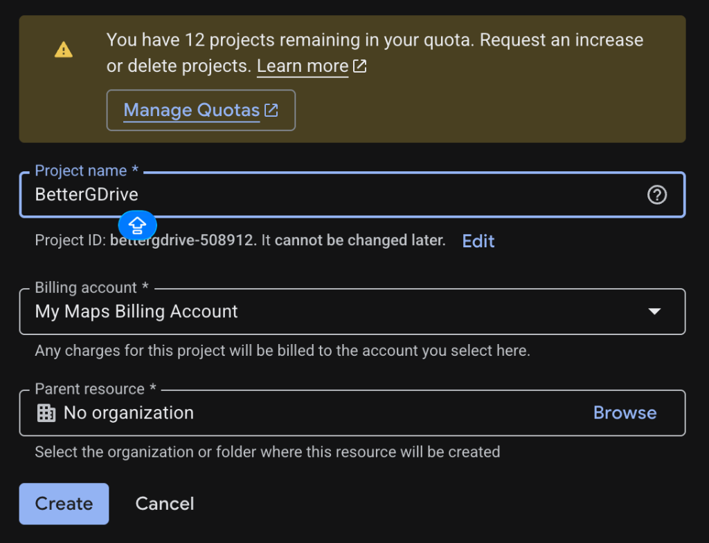

---

**2. Enable the Google Drive API**

Inside the project → **APIs & Services** → **Library** → search `Google Drive API` → **Enable**.

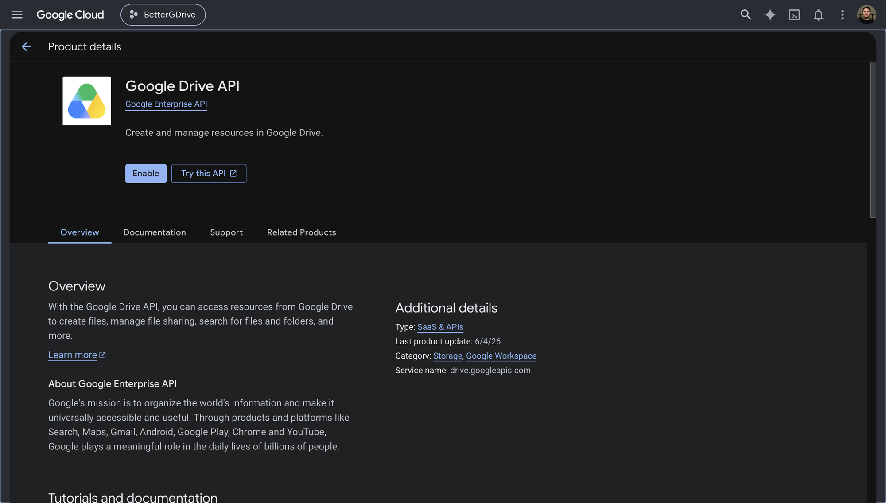

---

**3. Configure the OAuth consent screen**

Go to **Google Auth Platform** → **Overview** → **Get started**.

Fill in **App name** (`Better GDrive`) and your **support email**, then click **Next**.

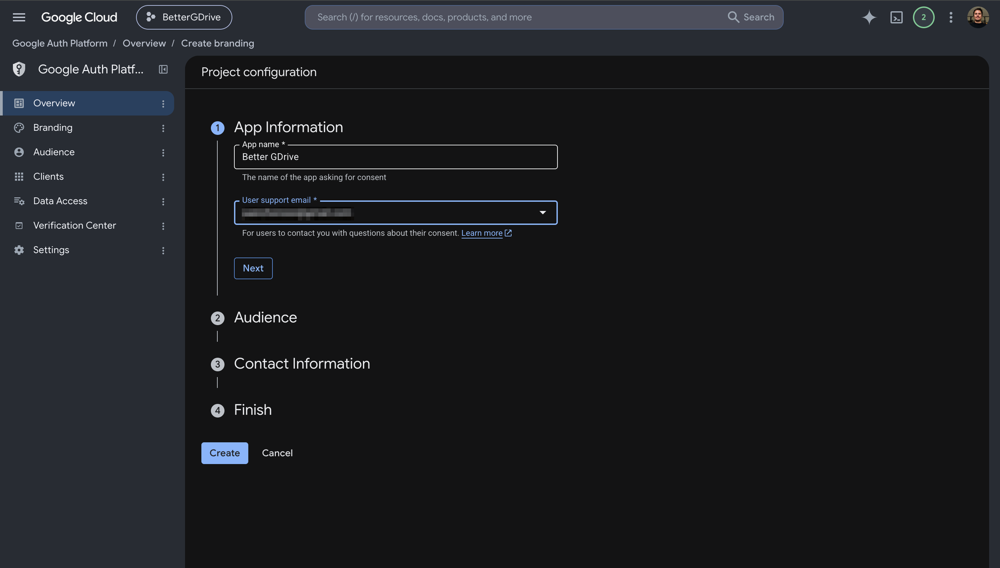

On the **Audience** step select **External** and click **Next**.

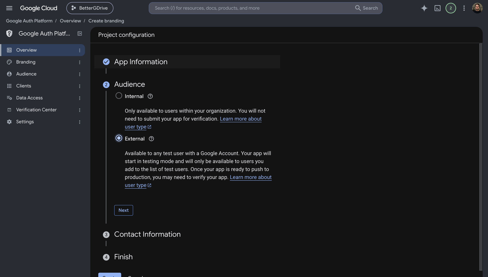

Fill in your **contact email**, click **Next** → agree to the policy → **Continue** → **Create**.

---

**4. Create an OAuth client**

Go to **Clients** → **Create client**.

Set **Application type** to `Desktop app`, name it `Better GDrive`, and click **Create**.

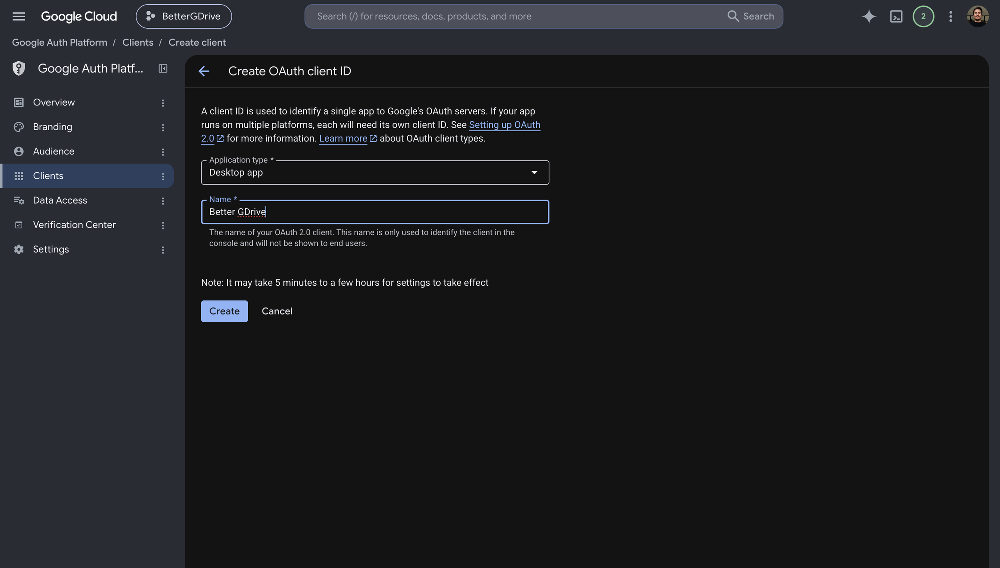

A dialog shows your **Client ID** and **Client secret** — copy both now, the secret won't be shown again.

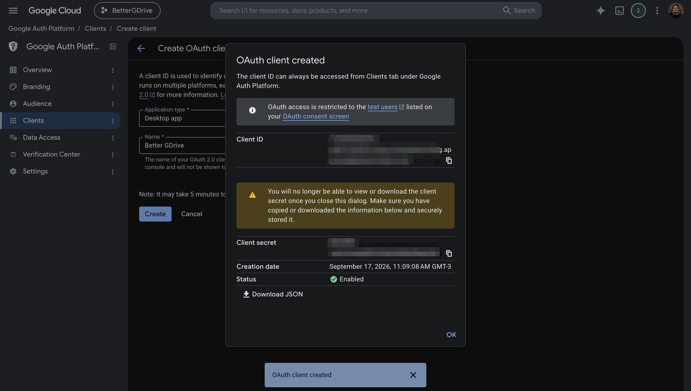

Your client now appears in the Clients list.

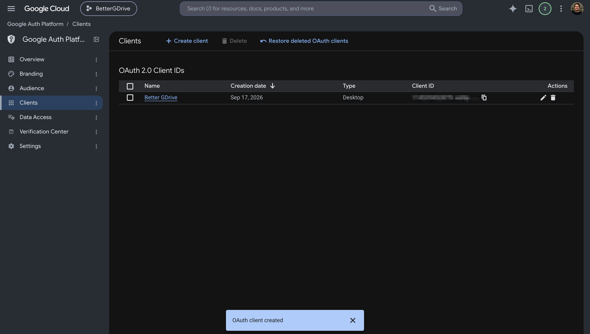

---

**5. Use your credentials with rclone**

When running `rclone config` to add the `gdrive:` remote, enter your `client_id` and `client_secret` when prompted instead of leaving them blank.

---

## Contributing

Pull requests are welcome. To contribute:

1. Fork the repo and create a branch
2. `xcodegen generate` to regenerate the Xcode project after editing `project.yml`
3. Open a PR with a clear description of what you changed and why

Please keep PRs focused. One thing per PR is ideal.

---

## Credits

Better GDrive is built on top of [rclone](https://rclone.org), created by Nick Craig-Wood and maintained by the rclone contributors. rclone does all the actual syncing — this app is a macOS UI layer on top of it.

rclone is distributed under the [MIT License](https://github.com/rclone/rclone/blob/master/COPYING).  
Copyright © 2012 by Nick Craig-Wood and the rclone contributors.

---

## License

Better GDrive is licensed under the **Apache License 2.0** — see the [LICENSE](LICENSE) file for the full text.

Copyright © 2026 Better GDrive contributors
